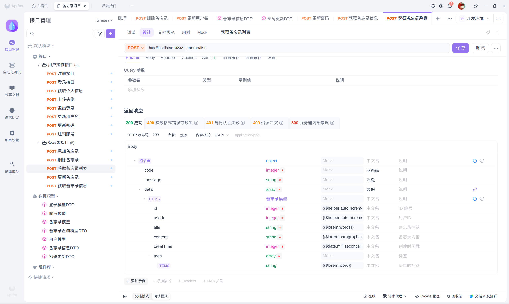

本平台旨在为小A第四周任务提供动态、隔离的临时 Java 开发运行环境。请在使用前详细阅读本说明。


* **任务4的 Api 设计使用工具为 Apifox**
  

> **警告：数据存储提醒**
> 本平台提供的是**临时、一次性**的容器环境。所有存储在容器内的数据（包括数据库文件、头像文件、备忘录记录）均为**临时存储**。一旦容器达到存活时长被系统自动回收，或您手动销毁环境，**容器内所有数据将立即且永久丢失**。请务必及时备份重要数据至本地。

## Contributor


---

## 1. 认证与安全机制

本系统采用 JWT (JSON Web Token) 进行身份校验。所有受保护接口均需在请求头中携带 Token。

**请求头格式：**
```http
Authorization: Bearer <您的Token>
```

**人机验证：**
在注册与登录接口中，必须集成 Cloudflare Turnstile。请将组件生成的 `cf-turnstile-response` 令牌作为 `cfToken` 字段一并发送给后端。

---

## 2. API 接口列表

### 2.1 用户操作接口

#### 2.1.1 注册账号

| 属性 | 说明 |
| :--- | :--- |
| **路径** | `/api/user/register` |
| **方法** | `POST` |
| **格式** | `application/json` |
| **描述** | 注册新账号，注册成功后自动登录并返回 JWT 令牌。 |
| **鉴权** | 无需 Token |

**请求参数说明：**

| 参数名 | 类型 | 必填 | 说明 |
| :--- | :--- | :--- | :--- |
| `username` | `string` | 是 | 用户名 |
| `password` | `string` | 是 | 前端 SHA-256 哈希后的密码 |
| `cfToken` | `string` | 是 | Cloudflare 验证组件获取的人机校验 Token |

**请求示例：**
```json
{
  "username": "小A",
  "password": "e3b0c44298fc1c149afbf4c8996fb92427ae41e4649b934ca495991b7852b855",
  "cfToken": "0.xx_xxxxx_xxxxxxxxxxxxx"
}
```

**成功响应 (200)：**
```json
{
  "code": 200,
  "message": "success",
  "data": "eyJhbGciOiJIUzI1NiJ9.eyJ1aWQiOjEsImV4c..."
}
```

---

#### 2.1.2 用户登录

| 属性 | 说明 |
| :--- | :--- |
| **路径** | `/api/user/login` |
| **方法** | `POST` |
| **格式** | `application/json` |
| **描述** | 校验身份并返回 JWT 令牌。 |
| **鉴权** | 无需 Token |

**请求参数说明：**

| 参数名 | 类型 | 必填 | 说明 |
| :--- | :--- | :--- | :--- |
| `username` | `string` | 是 | 用户名 |
| `password` | `string` | 是 | 前端 SHA-256 哈希后的密码 |
| `cfToken` | `string` | 是 | Cloudflare 验证组件获取的人机校验 Token |

**请求示例：**
```json
{
  "username": "小A",
  "password": "e3b0c44298fc1c149afbf4c8996fb92427ae41e4649b934ca495991b7852b855",
  "cfToken": "0.xx_xxxxx_xxxxxxxxxxxxx"
}
```

**成功响应 (200)：**
```json
{
  "code": 200,
  "message": "success",
  "data": "eyJhbGciOiJIUzI1NiJ9.eyJ1aWQiOjEsImV4c..."
}
```

---

#### 2.1.3 获取用户信息

| 属性 | 说明 |
| :--- | :--- |
| **路径** | `/api/user/info` |
| **方法** | `GET` |
| **格式** | 无请求体 |
| **描述** | 获取当前登录用户的基础信息 (`UserInfoDTO`)。 |
| **鉴权** | **需要 Token** |

**请求示例：**
*(HTTP GET 请求，无请求参数和请求体，直接在 Header 中携带 Token)*

**成功响应 (200)：**
```json
{
  "code": 200,
  "message": "success",
  "data": {
    "username": "小A",
    "createTime": 1700000000000,
    "id": 1,
    "avatar": "/uploads/avatar_1_1700000000000.png"
  }
}
```

---

#### 2.1.4 上传头像

| 属性 | 说明 |
| :--- | :--- |
| **路径** | `/api/user/upload-avatar` |
| **方法** | `POST` |
| **格式** | `multipart/form-data` |
| **描述** | 上传后返回头像的访问 URL。（仅支持 jpg, jpeg, png, webp 格式） |
| **鉴权** | **需要 Token** |

**请求参数说明：**

| 参数名 | 类型 | 必填 | 说明 |
| :--- | :--- | :--- | :--- |
| `avatar` | `file` | 是 | 用户头像文件（二进制流） |

**请求示例：**
*(通过 FormData 提交文件，无需 JSON 示例)*

**成功响应 (200)：**
```json
{
  "code": 200,
  "message": "success",
  "data": "/uploads/avatar_1_1700000000000.png"
}
```

---

#### 2.1.5 退出登录

| 属性 | 说明 |
| :--- | :--- |
| **路径** | `/api/user/logout` |
| **方法** | `POST` |
| **格式** | 无请求体 |
| **描述** | 退出当前登录会话，使在此时间之前签发的所有 Token 立即失效。 |
| **鉴权** | **需要 Token** |

**请求示例：**
*(直接发送 POST 请求，无请求参数和请求体)*

**成功响应 (200)：**
```json
{
  "code": 200,
  "message": "success",
  "data": "退出登录成功"
}
```


#### 2.1.6 更新用户名

| 属性 | 说明 |
| :--- | :--- |
| **路径** | `/api/user/update-username` |
| **方法** | `POST` |
| **格式** | `application/json` |
| **描述** | 修改当前登录用户的显示名称。 |
| **鉴权** | **需要 Token** |

**请求参数说明：**

| 参数名 | 类型 | 必填 | 说明 |
| :--- | :--- | :--- | :--- |
| `username` | `string` | 是 | 新的用户名（长度 3-16 字符） |

**请求示例：**
```json
{
  "username": "新用户名"
}
```

**成功响应 (200)：**
```json
{
  "code": 200,
  "message": "success",
  "data": "用户名更新成功"
}
```

---

#### 2.1.7 修改密码

| 属性 | 说明 |
| :--- | :--- |
| **路径** | `/api/user/update-password` |
| **方法** | `POST` |
| **格式** | `application/json` |
| **描述** | 校验旧密码并设置新的登录密码。 |
| **鉴权** | **需要 Token** |

**请求参数说明：**

| 参数名 | 类型 | 必填 | 说明 |
| :--- | :--- | :--- | :--- |
| `oldPassword` | `string` | 是 | 原密码的 SHA-256 哈希值 |
| `newPassword` | `string` | 是 | 新密码的 SHA-256 哈希值 |

**请求示例：**
```json
{
  "oldPassword": "e3b0c44298fc1c149afbf4c8996fb92427ae41e4649b934ca495991b7852b855",
  "newPassword": "87428fc522803d31065e7bce3cf03fe475096631e5e07bbd7a0fde60c4cf25c7"
}
```

**成功响应 (200)：**
```json
{
  "code": 200,
  "message": "success",
  "data": "账户密码已成功更新"
}
```

---

#### 2.1.8 注销账号

| 属性 | 说明 |
| :--- | :--- |
| **路径** | `/api/user/delete` |
| **方法** | `POST` |
| **格式** | 无请求体 |
| **描述** | 永久删除当前账户及其关联的所有数据（备忘录、头像等），该操作不可逆。 |
| **鉴权** | **需要 Token** |

**成功响应 (200)：**
```json
{
  "code": 200,
  "message": "success",
  "data": "账户及相关数据已永久注销"
}
```

---

### 3. 备忘录管理接口

所有备忘录接口数据仅限当前用户可见。

#### 3.1 添加备忘录

| 属性 | 说明 |
| :--- | :--- |
| **路径** | `/api/memo/create` |
| **方法** | `POST` |
| **格式** | `application/json` |
| **描述** | 创建一条新的备忘录记录，服务端会自动注入所属用户及创建时间。 |
| **鉴权** | **需要 Token** |

**请求参数说明：**

| 参数名 | 类型 | 必填 | 说明 |
| :--- | :--- | :--- | :--- |
| `title` | `string` | 是 | 备忘录标题 |
| `content` | `string` | 是 | 备忘录详细内容 |
| `tags` | `array` | 否 | 标签数组，例如 `["工作", "紧急"]` |

**请求示例：**
```json
{
  "title": "会议记录",
  "content": "讨论了第四周的需求细节和API规范设计...",
  "tags": ["工作", "重要"]
}
```

**成功响应 (200)：**
```json
{
  "code": 200,
  "message": "success",
  "data": 101
}
```
*(注：`data` 返回的是新创建记录的 `id` 值)*

---

#### 3.2 更新备忘录

| 属性 | 说明 |
| :--- | :--- |
| **路径** | `/api/memo/update` |
| **方法** | `POST` |
| **格式** | `application/json` |
| **描述** | 全量更新已有的备忘录记录，必须传入 ID。 |
| **鉴权** | **需要 Token** |

**请求参数说明：**

| 参数名 | 类型 | 必填 | 说明 |
| :--- | :--- | :--- | :--- |
| `id` | `integer` | 是 | 待更新的备忘录唯一标识符 |
| `title` | `string` | 是 | 备忘录标题 |
| `content` | `string` | 是 | 备忘录详细内容 |
| `tags` | `array` | 否 | 标签数组 |

**请求示例：**
```json
{
  "id": 101,
  "title": "会议记录(已修改)",
  "content": "补充了新的需求：全面应用表格规范格式。",
  "tags": ["工作"]
}
```

**成功响应 (200)：**
```json
{
  "code": 200,
  "message": "success",
  "data": "更新成功"
}
```

---

#### 3.3 删除备忘录

| 属性 | 说明 |
| :--- | :--- |
| **路径** | `/api/memo/delete` |
| **方法** | `POST` |
| **格式** | `application/x-www-form-urlencoded` |
| **描述** | 根据 ID 删除指定的备忘录（仅支持删除当前登录用户所属的数据）。 |
| **鉴权** | **需要 Token** |

**请求参数说明：**

| 参数名 | 类型 | 必填 | 说明 |
| :--- | :--- | :--- | :--- |
| `id` | `integer` | 是 | 要删除的备忘录 ID |

**请求示例：**
```http
POST /api/memo/delete?id=101
```

**成功响应 (200)：**
```json
{
  "code": 200,
  "message": "success",
  "data": "已成功删除"
}
```

---

#### 3.4 获取备忘录列表

| 属性 | 说明 |
| :--- | :--- |
| **路径** | `/api/memo/list` |
| **方法** | `POST` |
| **格式** | `application/json` |
| **描述** | 获取当前用户的备忘录列表，支持关键字搜索、标签过滤、日期限制及分页（`MemoQueryDTO`）。 |
| **鉴权** | **需要 Token** |

**请求参数说明：**

| 参数名 | 类型 | 必填 | 说明 |
| :--- | :--- | :--- | :--- |
| `keyword` | `string` | 否 | 搜索关键字（匹配标题或内容） |
| `tag` | `string` | 否 | 精确匹配的单一标签 |
| `days` | `integer`| 否 | 筛选最近几天的数据（例如: 3 或 7） |
| `page` | `integer`| 否 | 当前页码，默认 `1` |
| `size` | `integer`| 否 | 每页条数，默认 `10` |

**请求示例：**
```json
{
  "keyword": "会议",  
  "tag": "工作",      
  "days": 7,        
  "page": 1,        
  "size": 10        
}
```

**成功响应 (200)：**
```json
{
  "code": 200,
  "message": "success",
  "data": [
    {
      "id": 101,
      "userId": 1,
      "title": "会议记录",
      "content": "讨论了第四周的需求细节和API规范设计...",
      "tags": ["工作", "重要"],
      "creatTime": 1700000000000
    }
  ]
}
```
*(注：`data` 返回的是 `List<Memo>` 数组对象，注意模型字段拼写 `creatTime` 为 13 位时间戳)*

#### 3.5 获取备忘录统计信息

| 属性 | 说明 |
| :--- | :--- |
| **路径** | `/api/memo/info` |
| **方法** | `GET` |
| **格式** | 无请求体 |
| **描述** | 获取当前用户所有已创建的标签集合以及备忘录的总计数。 |
| **鉴权** | **需要 Token** |

**成功响应 (200)：**
```json
{
  "code": 200,
  "message": "success",
  "data": {
    "tags": ["工作", "生活", "紧急"],
    "total": 42
  }
}
```

---

## 4. 全局接口响应规范

为了保证前端调用的统一性，本系统所有 API 均遵循以下返回结构：

**成功响应 (200)：**
```json
{
  "code": 200,
  "message": "success",
  "data": { ... } // 该部分根据具体接口返回对应的数据模型、数组或字符串
}
```

**常见错误响应 (4xx/5xx)：**
```json
{
  "code": 403,
  "message": "人机验证未通过"
}
```
```json
{
  "code": 401,
  "message": "用户名或密码错误"
}
```

---

## 5. 开发建议与说明

*   **路径处理**：本 API 会自动处理容器生成的动态 `/web-{sid}/` 前缀，前端发起网络请求时请始终使用相对路径（如 `api/user/login`）进行调用。
*   **数据安全**：请在前端对密码进行 `SHA-256` 散列计算后再进行传输，后端系统接收后将再次进行加盐哈希存储。
*   **容器生命周期**：建议在前端界面显眼处展示运行环境倒计时。当 `timeout` 即将归零时，请强制提示用户提前备份关键数据。
