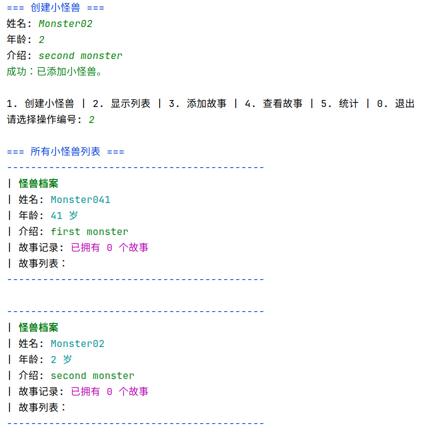
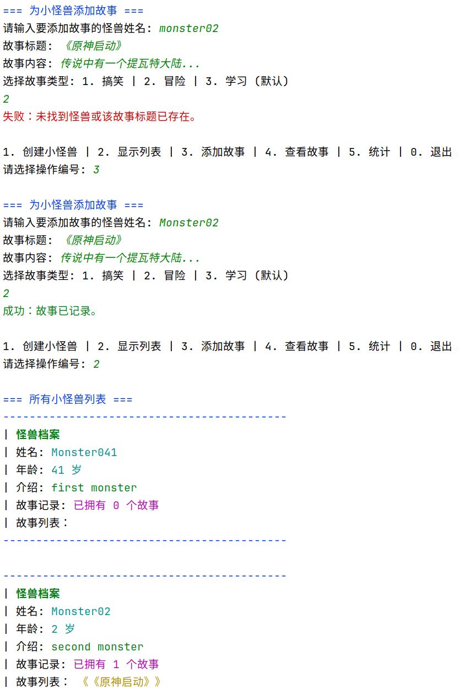
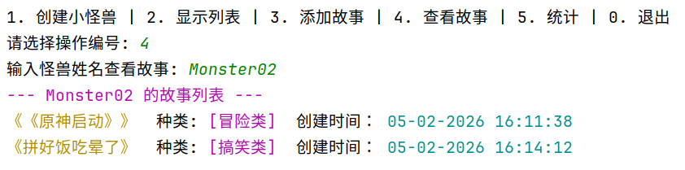
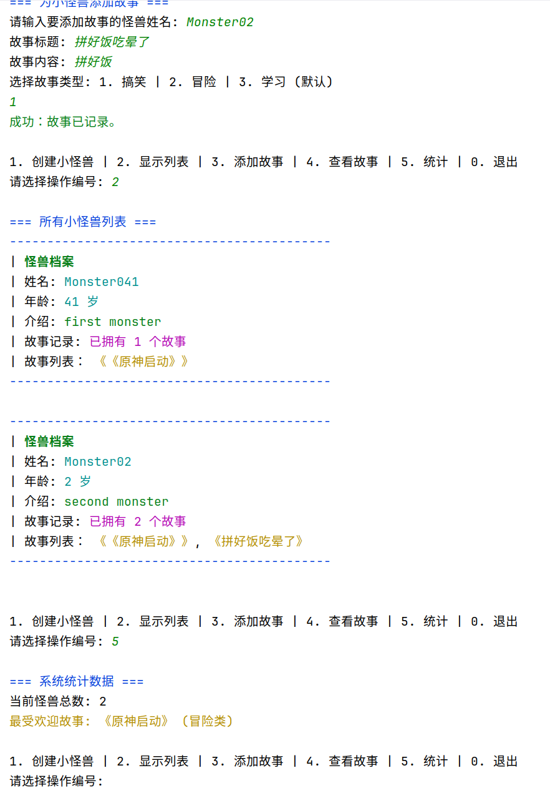

# 小怪兽故事记录系统 - 开发文档

## 1. 任务进度概览

### 基础功能需求
- [x] **小怪兽管理**：创建小怪兽（包含姓名、年龄、介绍等属性）
- [x] **显示功能**：显示所有小怪兽列表
- [x] **故事管理**：为特定小怪兽添加故事（包含标题、内容等属性）
- [x] **故事查看**：查看指定小怪兽的故事列表
- [x] **简单统计**：显示小怪兽拥有的故事数量

### 扩展思路与优化
- [x] **功能扩展**：添加“故事类型”枚举（搞笑类、冒险类、学习类）
- [x] **实现“故事时间”记录**：自动记录故事创建时的系统时间
- [x] **添加“最受欢迎故事”评选**：统计所有怪兽中标题出现频次最高的故事
- [x] **添加彩色控制台输出**：利用 ANSI 常量美化终端显示效果
- [x] **实现更友好的菜单系统**：结构化的菜单导航与分屏逻辑
- [x] **添加输入验证和错误处理**：通过自定义异常捕获逻辑错误，防止程序崩溃

---

## 2. 项目架构与类/接口说明

### 2.1 核心模型 (Models & Enums)
| 类/枚举名称 | 职责说明 | 关键点 |
| :--- | :--- | :--- |
| `MonsterModel` | 怪兽实体类 | 维护怪兽基本信息及该怪兽专属的 `ArrayList<StoryModel>` |
| `StoryModel` | 故事实体类 | 存储标题、内容、类型，并包含 `final` 修饰的只读创建时间 |
| `StoryEnum` | 故事类型枚举 | 定义 `FUNNY`, `ADVENTURE`, `LEARNING` 三种类型及描述文本 |

### 2.2 数据与逻辑层 (Repository & Services)
| 类/接口名称 | 类型 | 职责说明 |
| :--- | :--- | :--- |
| `MonsterRepository` | 类 | **仓储层**：封装底层 `HashMap`，提供最基础的数据增删改查 |
| `IMonsterService` | 接口 | 定义怪兽业务标准，如添加怪兽、关联故事、按名检索等 |
| `MonsterServiceImpl`| 实现类 | **业务中心**：处理怪兽逻辑，验证数据有效性，调用仓储层 |
| `IStatistics` | 接口 | 定义统计标准，负责跨对象的数据分析 |
| `StatisticsImpl` | 实现类 | 实现“最受欢迎故事”算法，通过流处理统计全局最高频故事标题 |

### 2.3 表现层与工具 (UI & Utils)
| 类名称 | 职责说明 |
| :--- | :--- |
| `ConsoleMenu` | **UI 交互层**：封装所有 `Scanner` 输入逻辑，负责数据的格式化展示 |
| `ConsoleColors` | 样式常量类，存储各种 ANSI 颜色转义码，实现彩色输出 |
| `IllegalMonsterException`| **自定义异常**：当怪兽名重复或操作非法时抛出，以便 UI 层捕获提示 |
| `DateUtil` | 工具类，提供统一的时间格式化模板（如 yyyy-MM-dd HH:mm） |
| `Main` | 程序入口类，持有 UI 和 Service 引用，负责整个生命周期的调度 |

---

## 3. 操作用法与反馈说明

### 3.1 创建小怪兽
* **操作用法**：
    1. 在主菜单选择 `1`。
    2. 依次输入怪兽的姓名、年龄和背景介绍。
* **反馈结果**：
    * **成功**：控制台输出绿色提示“成功：已添加小怪兽”。
    * **失败**：若姓名重复，UI 会捕获 `IllegalMonsterException` 并显示红色警告“失败：该名字已存在”。

---

---

### 3.2 显示所有小怪兽
* **操作用法**：在主菜单选择 `2`。
* **反馈结果**：系统以表格卡片形式打印所有怪兽信息。通过重写的 `MonsterModel.toString()`，你会看到蓝色的边框高亮，以及该怪兽目前拥有的故事标题简报。

---

---

### 3.3 为小怪兽添加故事
* **操作用法**：
    1. 选择 `3`，输入目标怪兽姓名。
    2. 输入故事标题、正文内容，并从 1-3 中选择一个故事类型。
* **反馈结果**：成功后显示绿色确认；若怪兽不存在，则反馈红色错误提示。

---

---

### 3.4 查看特定怪兽的故事集
* **操作用法**：选择 `4`，输入想要查询的怪兽姓名。
* **反馈结果**：系统将过滤出该怪兽的所有故事，每条故事都会带上专属的标签颜色（如学习类为紫色）和精确的记录时间。

---

---

### 3.5 数据统计分析
* **操作用法**：选择 `5`。
* **反馈结果**：
    * 第一部分：显示当前系统内已录入的怪兽总数。
    * 第二部分：显示“最受欢迎故事”，这是根据全局怪兽故事标题汇总计算出的热门榜单。

---

---